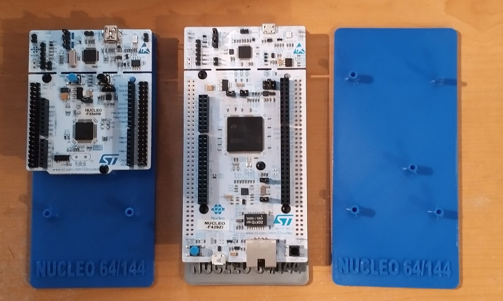

3D Printable Stands
-------------------

These are a couple of stands I made to mount the Nucleo 64 and Nucleo 144
boards on. Since the "Morpho" connectors go down the bottom too, there is
a risk of hitting something on the table/workbench that might short out a
pin or two. This puts a nice insulated space between the board and the
tabletop.

There are two files here; one is for Nucleo-64 boards, and the other can
hold either Nucleo-64 or Nucleo-144 boards. I have printed several successfully
in PLA on my Prusa i3 MK3S printer using the "0.20 PLA/Quality" standard 
presets. 

The mounting posts are 2.85mm holes and will take an M3 or 4-40 machine
screw. I've used 4-40 BHCS screws because I've got a ton left over from a
project where I was using them to mount heatsinks to TO-220 transistors.
The trick is to gently screw them in, if you over tighten them you can
easily strip the plastic.

PLA (or maybe PETG) is likely the best material for these. They aren't 
structural so they don't need a lot of strength. That said the
position of the holes is critical so you want them to be dimensionally
accuracte and shrinkage could make them not work.

The back/bottom of these are smooth, so if you want a non-slip back
you can stick on rubber feet, or use double-adhesive tape to hold them
in place. The picture below shows the Nucleo-64, Nucleo-144, and an
empty "universal" stand.

